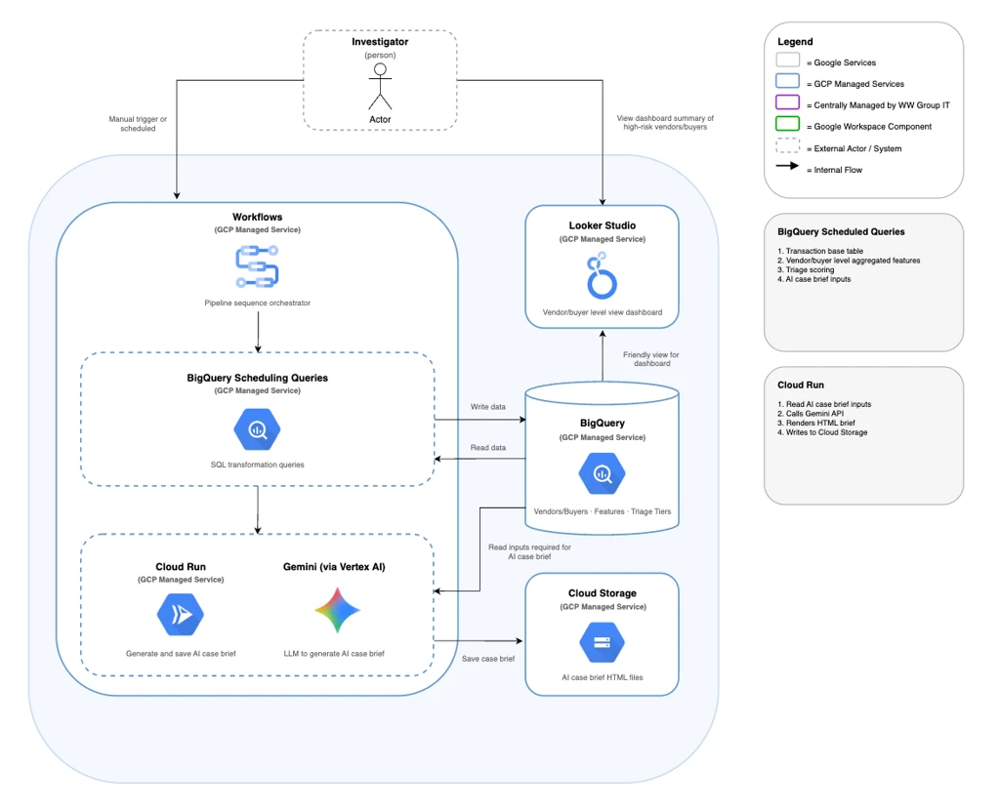

# Fraud Detection Pipeline

AI-assisted vendor fraud detection pipeline for Woolworths Group procurement data. The pipeline ingests data from SAP, Ariba, and Maximo, builds vendor-level risk features, scores vendors by fraud risk, and generates AI case briefs for investigators using Gemini.

## Architecture



The pipeline is orchestrated by GCP Workflows and runs in three stages:

1. **BigQuery:** SQL pipeline refreshes vendor data, features, triage scores, and case brief inputs
2. **Cloud Run:** calls Gemini to generate an HTML case brief per high-risk vendor
3. **Cloud Storage:** stores generated HTML briefs
4. **Looker Studio:** dashboard for investigators to view vendor risk summaries

## Repo Structure

```
├── sql/
│   ├── setup/          # Input views over source datasets (Ariba, SAP)
│   └── pipeline/       # BigQuery pipeline tables — run in this order:
│       ├── base_transaction.sql
│       ├── vendor_attributes.sql
│       ├── employee_attributes.sql
│       ├── vendor_features.sql
│       ├── employee_features.sql
├── brief/              # Cloud Run service — generates HTML case briefs via Gemini
├── workflows/          # GCP Workflows pipeline definition
├── routines/           # Existing risk team P2P control check views (reference only)
├── scripts/            # Deployment and utility scripts
├── test/               # Connectivity tests
└── docs/               # Architecture diagram
```

## Prerequisites

- GCP project: `agentic-platforms-sandbox`
- [gcloud CLI](https://cloud.google.com/sdk/docs/install) authenticated
- Python 3.11+
- Docker (for Cloud Run builds)

### Installing gcloud in the Claude Code Container

If using the Claude Code devcontainer, install the gcloud CLI using the Debian package:

```bash
sudo apt-get update
sudo apt-get install ca-certificates gnupg curl
curl https://packages.cloud.google.com/apt/doc/apt-key.gpg | sudo gpg --dearmor -o /usr/share/keyrings/cloud.google.gpg
echo "deb [signed-by=/usr/share/keyrings/cloud.google.gpg] https://packages.cloud.google.com/apt cloud-sdk main" | sudo tee -a /etc/apt/sources.list.d/google-cloud-sdk.list
sudo apt-get update && sudo apt-get install google-cloud-cli
```

## Setup

```bash
# 1. Copy and fill in environment variables
cp .env.example .env

# 2. Authenticate with GCP
gcloud auth application-default login

# 3. Install Python dependencies
pip install -r requirements.txt
```

## Environment Variables

See `.env.example` for the full list. Key variables:

| Variable         | Description                                                              |
| ---------------- | ------------------------------------------------------------------------ |
| `GCP_PROJECT_ID` | Billing project for BigQuery jobs                                        |
| `GCP_LOCATION`   | GCP region required for deployment scripts only, not the pipeline runner |
| `BQ_DATASET`     | Target BigQuery dataset                                                  |
| `CLOUD_RUN_URL`  | Deployed Cloud Run service URL                                           |
| `GCS_BUCKET`     | Cloud Storage bucket for SQL pipeline files and generated HTML briefs    |

## Running Locally

Use `run_pipeline.py` to run the full pipeline with your personal ADC credentials. This is the development path while Workflows service account access to enterprise source datasets is being provisioned.

```bash
python3 scripts/run_pipeline.py            # setup views + pipeline SQL + brief trigger
python3 scripts/run_pipeline.py --sql-only # setup views + pipeline SQL only
```

Setup views (`sql/setup/`) always run first and are skipped gracefully if source dataset access is unavailable (e.g. BSEG). Pipeline tables (`sql/pipeline/`) follow in dependency order. Empty SQL files are skipped with a warning.

## Deployment

### Deploy Cloud Run (brief generation service)

```bash
bash scripts/deploy_brief.sh
```

### Upload SQL files to Cloud Storage

Required for the Workflows pipeline to read SQL at runtime.

```bash
bash scripts/deploy_sql.sh
```

### Deploy Workflow

```bash
bash scripts/deploy_workflow.sh
```

### Execute Workflow (console)

Go to **GCP Console / Workflows / wwait-fraud-pipeline / Execute** with no input arguments (project, location, and Cloud Run URL are hardcoded in the workflow).

## Testing Connectivity

```bash
# Test BigQuery source dataset access
python3 test/test_bigquery.py

# Test Gemini access
python3 test/test_gemini.py
```
